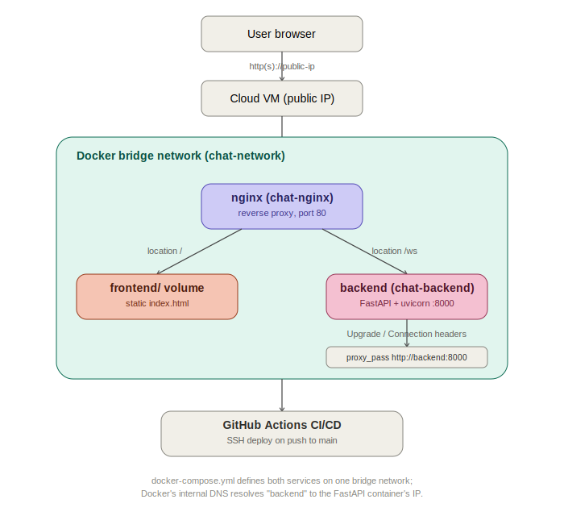

# Real-Time Chat — Dockerized Deployment (DevOps Assignment)

A FastAPI WebSocket chat application, containerized behind an Nginx reverse
proxy, deployed to a cloud VM with an automated GitHub Actions CI/CD pipeline.

## Live deployment

**Public IP:** http://161.118.170.239

Verified working: chat UI loads and connects, multi-user real-time
messaging confirmed across separate devices/networks (desktop + mobile,
different ISPs), containers survive both a killed process and a full VM
reboot without manual intervention, and pushes to `main` auto-deploy via
GitHub Actions.



## Project overview

Two containers on a private Docker bridge network:

| Service | Image | Role |
|---|---|---|
| `backend` | built from `Dockerfile` (python:3.11-slim) | FastAPI app serving the `/ws` WebSocket endpoint |
| `nginx` | `nginx:alpine` | Reverse proxy — serves the static frontend and proxies `/ws` to the backend |

Only Nginx is exposed to the host (port 80). The backend is reachable only
from inside the Docker network, which is the correct production posture —
no reason to expose an internal service port publicly.

## Issues found and how they were fixed

The repository as provided had three deliberate misconfigurations. All three
are the same underlying category of mistake — confusing "inside a container"
networking with "on my laptop" networking — which is worth calling out
explicitly if you're asked about it.

**1. Backend bound to `127.0.0.1` instead of `0.0.0.0` (`Dockerfile`)**
`CMD ["uvicorn", "main:app", "--host", "127.0.0.1", ...]` makes uvicorn only
accept connections that originate *inside its own container's network
namespace*. Nginx, in a separate container, is a different network namespace
entirely — its requests were being refused at the TCP level before FastAPI
ever saw them. Fix: bind to `0.0.0.0` so uvicorn listens on all interfaces,
including the internal Docker network interface Nginx connects through.

**2. Frontend volume mount commented out (`docker-compose.yml`)**
The line mounting `./frontend` into `/usr/share/nginx/html` was disabled, so
the Nginx container fell back to its own image's default landing page.
Fix: uncommented and enabled the bind mount (read-only, since Nginx only
needs to read these files) — `./frontend:/usr/share/nginx/html:ro`.

**3. WebSocket proxy target and missing upgrade headers (`nginx.conf`)**
Two separate bugs in the same block:
- `proxy_pass http://localhost:8000/ws;` — inside the Nginx container,
  `localhost` refers to the Nginx container itself, which has nothing
  listening on 8000. Docker Compose gives every service a DNS entry equal to
  its service name on the shared network, so the fix is
  `proxy_pass http://backend:8000/ws;`.
- The `Upgrade` and `Connection` headers were commented out. A WebSocket
  connection starts as a normal HTTP request with an `Upgrade: websocket`
  header; Nginx has to forward that header (and set `Connection: upgrade`)
  or it treats the request as ordinary HTTP and the client-side handshake
  fails, which is exactly the "stuck on Disconnected" symptom described in
  the assignment brief.

### Additional hardening beyond the minimum fix

- Added a `HEALTHCHECK` to the backend image (probing `/favicon.ico`, which
  always returns 204 regardless of whether the frontend files are present in
  this container) and wired `depends_on: condition: service_healthy` in
  Compose, so Nginx only starts routing traffic once the backend is actually
  accepting connections — not just once the container process has started.
- `restart: always` on both services, per the assignment's stated
  requirement — containers come back up after a crash or a host reboot
  (systemd starts the Docker daemon on boot, and Docker restarts containers
  with this policy). Verified by killing the backend's process directly
  (`docker exec chat-backend kill -9 1`) and by a full `sudo reboot` of the
  VM — both times the container returned to a healthy state with no manual
  intervention.
- Explicit named bridge network (`chat-network`) instead of relying on the
  Compose default, for clarity when this grows past two services.
- Dropped the obsolete `version: '3.8'` key — modern Docker Compose (v2)
  ignores it and prints a warning; the Compose spec no longer uses it.

### Bug found during live testing (frontend, not infrastructure)

While testing on an actual phone rather than desktop browser dev tools, the
message input and send button were invisible — pushed below the visible
viewport. Root cause: `frontend/index.html` sized the chat container with
`100vh`/`95vh`, but mobile browsers include the address bar's height in
`vh` calculations even though it isn't part of the visible viewport once
shown. Combined with `overflow: hidden` on `body`, there was no way to
scroll down to reach the input. Fixed by adding `100dvh` (dynamic viewport
height, which tracks the actual visible area) alongside the `vh` fallback,
plus `env(safe-area-inset-bottom)` padding on the input footer so it isn't
crowded by gesture-navigation bars on notched devices. This is a frontend
CSS fix only — no application logic, WebSocket handling, or backend code
was touched.

### Timestamp timezone (infrastructure fix, not application code)

Message timestamps were showing server time (UTC, the default for most
cloud VM images) rather than the viewer's local time. Setting the VM's own
OS timezone with `timedatectl` was not sufficient on its own — Docker
containers have their own isolated filesystem and don't inherit the host's
timezone automatically. Fixed by mounting the host's `/etc/localtime` and
`/etc/timezone` into the `backend` container (read-only) in
`docker-compose.yml`, so `datetime.now()` inside `app/main.py` resolves
correctly without any change to the application code itself.

### Frontend chat restrictions (added on top of the assignment's scope)

Two client-side guards were added to `frontend/index.html` — no backend code
was touched, per the assignment's instructions:

- **2,500-character message limit**, enforced via the input's `maxlength`
  attribute and re-checked in JavaScript before sending, with a live counter
  shown to the user.
- **Sliding-window rate limit**: at most 5 messages per rolling 10-second
  window. Sending faster than that disables the input and send button and
  shows a live countdown ("Sending too fast — please wait Ns") until the
  window clears, rather than silently dropping messages. An earlier
  flat 400ms-between-sends version was replaced with this, since a flat
  interval alone still allowed a steady stream of ~2 messages/second, which
  still looked and functioned like spam.
- Input is also stripped of control characters and has excess whitespace
  collapsed before being sent.

**Honest scope note on "script injection" protection:** the existing
frontend was already safe against XSS/script injection before any of this
was added — every incoming message is inserted into the page using
`element.textContent`, never `innerHTML`, so the browser always renders
message content as inert plain text, even if someone sends literal
`<script>` tags. No change was needed there.

There is no SQL injection surface in this application at all — the backend
(`app/main.py`) uses no database; it's a pure in-memory WebSocket broadcast
between connected clients.

**Important limitation, disclosed rather than hidden:** the character limit
and spam guard above are client-side only. Since the assignment says not to
modify the backend, they apply to anyone using the provided web UI, but a
client that connects directly to the raw `/ws` WebSocket endpoint
(bypassing the browser entirely, e.g. with a script or `wscat`) is not
restricted by them, because `app/main.py` accepts and broadcasts any text
it receives without validation. Enforcing these limits server-side —
rejecting oversized messages, rate-limiting per connection — would require
editing `app/main.py`, which is out of scope here. This is called out
explicitly rather than presented as a complete security guarantee it isn't.

## Docker Compose version note

`docker-compose.yml` omits the `version:` key seen in the original file
(e.g. `version: '3.8'`) — the Compose Specification deprecated this field,
and modern `docker compose` (v2, the plugin form used throughout this
project) prints a warning and ignores it if present.

## How Docker networking works here

Docker Compose creates a private bridge network for the project and attaches
an embedded DNS server to it. Every service gets a DNS record equal to its
service name — that's why `nginx.conf` can say `proxy_pass
http://backend:8000` instead of hardcoding an IP: Docker resolves `backend`
to whatever internal IP that container currently has, which is what makes
containers restartable/replaceable without reconfiguring anything downstream.

`expose: ["8000"]` on the backend documents the port for other containers on
the network without publishing it to the host — there is deliberately no
`ports:` mapping for the backend, since nothing outside the Docker network
should talk to FastAPI directly.

## How the Nginx reverse proxy works

Two `location` blocks in `nginx.conf`:

- `location /` — serves files straight from `/usr/share/nginx/html` (the
  mounted `frontend/` directory), falling back to `index.html` for any path
  that doesn't match a real file (`try_files ... /index.html`), which is the
  standard pattern for a single-page app.
- `location /ws` — proxies to the backend and adds the headers required to
  keep a WebSocket connection alive: `proxy_http_version 1.1` (WebSocket
  requires HTTP/1.1), `Upgrade`/`Connection` for the protocol switch, and a
  long `proxy_read_timeout`/`proxy_send_timeout` (86400s) since a chat socket
  is meant to stay open indefinitely rather than timing out like a normal
  HTTP request.

## How CI/CD works

`.github/workflows/deploy.yml` triggers on every push to `main`:

1. Checks out the repo (mostly so the workflow file itself is versioned;
   the actual deploy pulls fresh code on the server).
2. SSHes into the server using credentials stored as GitHub Secrets
   (`SERVER_HOST`, `SERVER_USER`, `SERVER_SSH_KEY`, `SERVER_PORT`).
3. On the server: `git fetch` + `git reset --hard origin/main` to sync the
   working copy, then `docker compose up -d --build` to rebuild any changed
   image and restart containers with zero manual steps.
4. Prunes dangling images so the VM's disk doesn't fill up over repeated
   deploys.
5. Runs a follow-up SSH step that checks container status and curls
   `localhost` on the server, so a broken deploy shows up as a failed
   GitHub Actions run instead of silently going live.

## Deploying it yourself

### 1. Local verification

```bash
git clone <your-fork-url>
cd devops
docker compose up -d --build
docker compose ps      # both services should show healthy/running
```
Visit `http://localhost` — the chat UI should load and show "Connected".
Open a second browser tab to confirm multi-user broadcast works.

### 2. Cloud VM setup (example: Oracle Cloud Free Tier)

1. Create an "Always Free" Ampere or E2.1.Micro instance (Ubuntu 22.04).
2. Open port 80 (and 22 for SSH) in both the VM's security list/NSG **and**
   the OS firewall (`sudo ufw allow 80,22/tcp`) — Oracle Cloud blocks
   traffic at the cloud level even if `iptables`/`ufw` on the box allows it.
3. SSH in and install Docker:
   ```bash
   curl -fsSL https://get.docker.com | sudo sh
   sudo usermod -aG docker $USER   # log out/in after this
   sudo apt-get install -y docker-compose-plugin
   ```
4. Clone the repo onto the VM and bring it up once manually to confirm it
   works end to end, matching step 1 above but against the VM's public IP.

### 3. Wire up GitHub Actions

In your GitHub repo → **Settings → Secrets and variables → Actions**, add:

| Secret | Value |
|---|---|
| `SERVER_HOST` | VM's public IP |
| `SERVER_USER` | SSH username (e.g. `ubuntu`) |
| `SERVER_SSH_KEY` | Private key with access to the VM (generate a dedicated deploy key, don't reuse your personal key) |
| `SERVER_PORT` | `22` (or your custom SSH port) |

Push to `main` and watch the **Actions** tab — the workflow will SSH in,
pull, rebuild, and restart automatically from then on.

### 4. Confirm

```
http://<your-public-ip>
```

## Repository structure

```
devops/
├── .github/workflows/deploy.yml   # CI/CD pipeline
├── app/
│   ├── main.py                    # FastAPI app (unmodified)
│   └── requirements.txt
├── frontend/
│   └── index.html                 # chat UI (unmodified)
├── docs/
│   └── architecture.svg
├── Dockerfile                     # fixed: 0.0.0.0 bind + healthcheck
├── docker-compose.yml             # fixed: volume mount, network, healthy-dependency
├── nginx.conf                     # fixed: backend service name, upgrade headers
└── README.md
```

## Bonus items not implemented (out of scope for this pass)

HTTPS via Let's Encrypt, Redis-backed presence/state, Terraform IaC, and a
load-balancer writeup were left out to keep this submission focused on the
mandatory requirements — happy to add any of them on request.